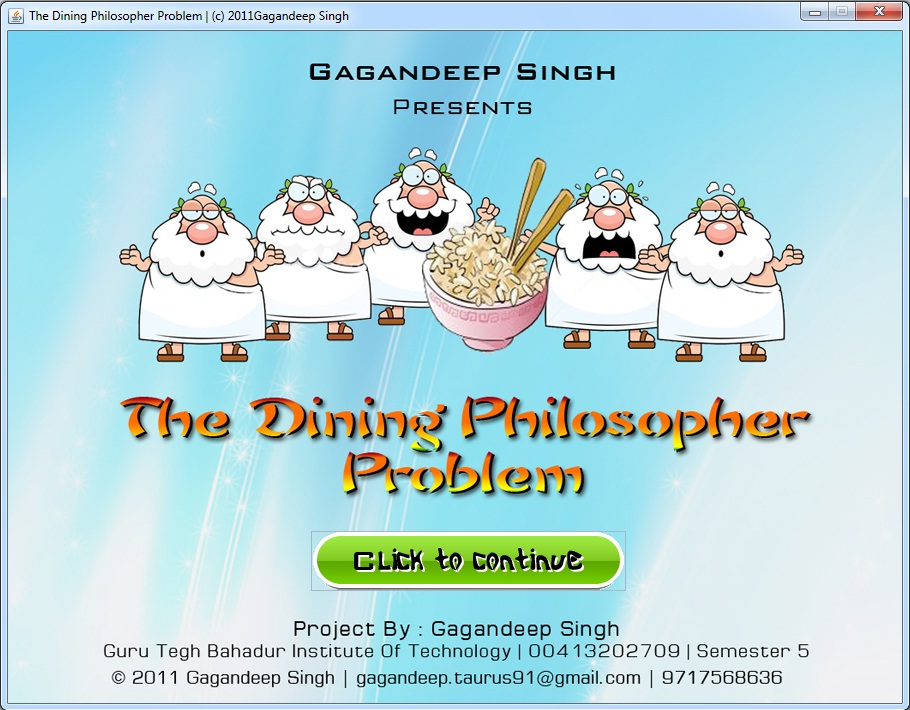

**(2011 - Mid-Graduation Summer Training)**

# The Dining Philosopher Problem (2011)

The dining philosopher problem is considered a classic synchronization problem as it is an example of large class of concurrency-control problem. It is a simple representation of the need to allocate several resources among several processes in a deadlock-free and starvation-free manner. In 1965, Edsger Dijkstra set an examination question on a synchronization problem where five computers competed for access to five shared tape drive peripherals. Soon afterwards the problem was retold by Tony Hoare as the dining philosophers problem.

The aim of the project is to develop a system of five processes/threads (represented by five philosophers) that compete with each other for five resources (represented by chopsticks).

#### Programming Language:

The project has been build in **Java (Java SE Develeopment Kit 6)** programming language using **NetBeans IDE 6.9.1**.

## Preamble

The project titled ‘The Dining Philosopher Problem’
is a part of Summer Training in Java Programming
Language 20 July - 8 August 2011 and has been
submitted as a summer training project in Guru Tegh
Bahadur Institute of Technology for partial
fulfillment of the requirements for the award degree
of Bachelor of Technology in Computer Science and Engineering.

The Project aims at developing a system of five
processes competing for five resources in deadlock
free environment. The project uses concept of
process synchronization and java multithreading &
swings as described in semester’s subjects.

## Thesis
Click [here](_Publish/Thesis_DiningPhilosopher_2011.pdf) to download thesis for the project.

Click [here](_Publish/PPT_DiningPhilosopher.pdf) to download Power-Point presentation.

## Theory

Consider five philosophers who spend their lives thinking and eating. The philosophers share a circular table surrounded by five chairs, each belonging to one philosopher. In the center of the table is a bowl of rice, and the table is laid with five chopsticks. When a philosopher thinks, he does not interact with his colleagues. From time to time, a philosopher gets hungry and tries to pick up the two chopsticks that are closest to him (the chopsticks that are between him and his left and right neighbors). A philosopher may pick up only one chopstick at a time. When a hungry philosopher has both his chopsticks at the same time, he eats without releasing his chopsticks. When he is finished eating, he puts down both of his chopsticks and start thinking again.

#### Issue: 
Suppose that all five philosophers become hungry simultaneously and grabs his left chopstick. When each philosopher tries to grab his right chopstick, he will be delayed forever.
Mutual exclusion is the core idea of the problem, and the dining philosophers create a generic and abstract scenario useful for explaining issues of this type. The failures these philosophers may experience are analogous to the difficulties that arise in real computer programming when multiple programs need exclusive access to shared resources.
The original problems of Dijkstra were related to external devices like tape drives. However, the difficulties studied in the Dining Philosophers problem arise far more often when multiple processes access sets of data that are being updated. Systems that must deal with a large number of parallel processes, such as operating system kernels, use thousands of locks and synchronizations that require strict adherence to methods and protocols if such problems as deadlock, starvation, or data corruption are to be avoided.

#### Solutions:
The solutions to dining problem involves establishment of set of protocols that ensure a deadlock free environment. Some of the solutions demonstrated are:

1. Allow at most four philosopher to be sitting simultaneously at the table.
2. Allow a philosopher to pick up his chopsticks only if both chopsticks are available.
3. Use an asymmetric solution i.e. an odd philosopher picks up his left chopstick and then his right chopstick, whereas an even philosopher picks up his right chopstick and then his left chopstick.
 

## Screenshots

|    |   |
|---|---|
|    |   |
|   |   |
|   |   |
|   |   |

## How to run

- Download and extract [Disk_DinningPhilosopher.zip](_Publish/Disk_DinningPhilosopher.zip) from [_Publish/](_Publish) directory.
- Run 'Dining.exe'.

## References

- Operating System Concepts, 7th Edition by Silberschatz, Galvin
- The Complete Reference Java, 7th Edition by Herbert Schildt

